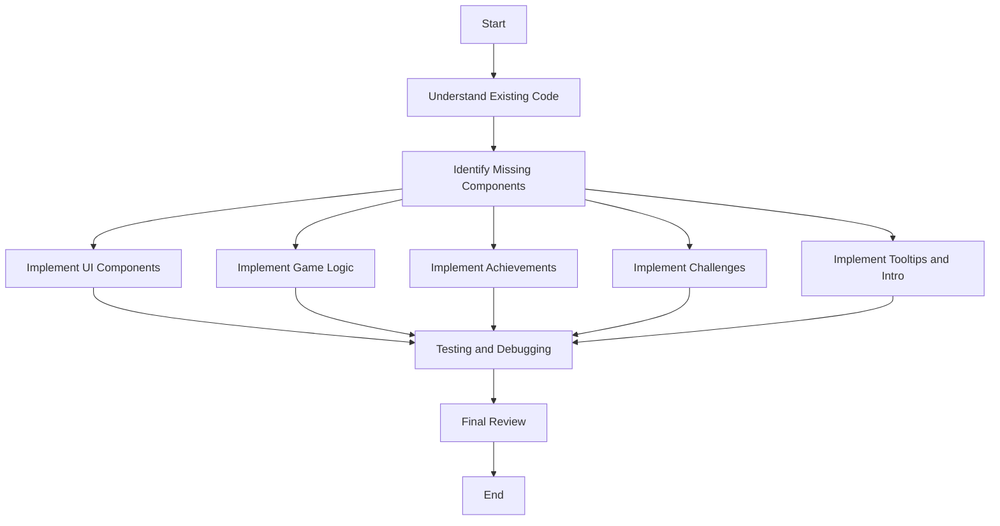

# Euler Adventure Plan

## Overview
This plan outlines the steps to complete the `euler_adventure.tsx` file. The file is a React component that creates an interactive educational game about the mathematical constant `e`. The game includes various challenges and achievements related to `e` and its applications.

## Steps

1. **Understand the Existing Code**
   - Review the provided `euler_adventure.tsx` file to understand the current state and structure of the component.
   - Identify the key features and functionalities already implemented.

2. **Identify Missing Components**
   - Determine which parts of the game are not yet implemented or need completion.
   - Focus on the following areas:
     - **UI Components**: Ensure all necessary UI elements are in place.
     - **Game Logic**: Implement the core game mechanics.
     - **Achievements**: Ensure all achievements are tracked and displayed correctly.
     - **Challenges**: Implement all defined challenges.
     - **Tooltips and Intro**: Ensure tooltips and the introduction sequence are functional.

3. **Implement Missing Components**
   - **UI Components**:
     - Create or complete any missing UI components such as buttons, input fields, and display areas.
   - **Game Logic**:
     - Implement the core game mechanics, including score tracking, digit revelation, and growth rate adjustments.
   - **Achievements**:
     - Ensure all achievements are tracked and displayed correctly.
   - **Challenges**:
     - Implement all defined challenges, including matrix operations, derivative calculations, and compound interest calculations.
   - **Tooltips and Intro**:
     - Ensure tooltips and the introduction sequence are functional and provide helpful information to the user.

4. **Testing and Debugging**
   - Test the completed component to ensure all features work as expected.
   - Debug any issues that arise during testing.

5. **Final Review**
   - Review the completed component for any remaining issues or improvements.
   - Ensure the code is clean, well-documented, and follows best practices.

## Mermaid Diagram

## Conclusion
This plan provides a structured approach to completing the `euler_adventure.tsx` file. By following these steps, we can ensure that the game is fully functional, educational, and engaging.